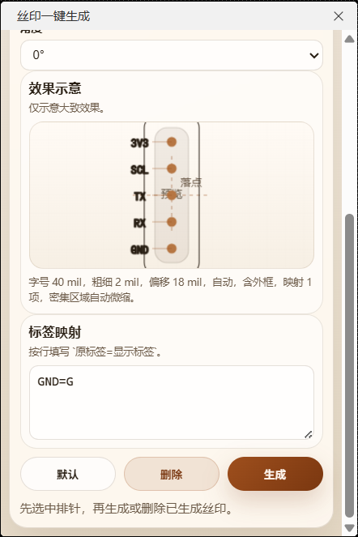

[简体中文](#) | [English](./README.en.md) | [繁體中文](./README.zh-Hant.md) | [日本語](./README.ja.md) | [Русский](./README.ru.md)

# 丝印一键生成

面向嘉立创EDA / EasyEDA Pro PCB 编辑器的扩展，用于根据排针、排母焊盘上的网络名快速生成和管理丝印。

## 功能概览

- 识别当前选中的排针或排母器件，也支持从选中的焊盘回溯到所属器件。
- 根据焊盘网络名自动提取较短标签，没有网络名时回退为 `P1`、`P2` 这类编号。
- 支持自定义标签映射，可按行填写 `原标签=显示标签`，例如 `GND=G`、`PA15=A15`。
- 自动分析器件方向、单双排结构、行列关系和外框范围。
- 提供紧凑型选项卡面板，可配置字体、单位、图层、字号、粗细、相对排布、角度、偏移、外框和反相。
- 在布局页提供效果示意，并保持较小面板占用，减少对 PCB 画布的遮挡。
- 在较密集的区域会基于你设定的字号自动微缩部分丝印，减少相邻标签重叠。
- 支持删除当前排针已生成的整组丝印；旧版本生成但未记录的丝印会回退为框选范围删除。
- 对网络解析和几何解析增加缓存，重复生成同一排针时等待更短。

## 生成流程

1. 在 PCB 中选中一个排针、排母，或选中其任意焊盘。
2. 打开顶栏菜单 `丝印一键生成 > 生成丝印...`。
3. 在“快速”和“布局”页调整参数；如需缩写标签，可在“标签映射”框中按行填写映射规则。
4. 点击 `生成`。
5. 回到 PCB 画布，用两次点选或拖出一个矩形范围作为丝印分布区域。
6. 插件会按范围分布丝印，并在必要时自动缩小密集区域中的标签。


## 删除流程

1. 在 PCB 中选中一个已经生成过丝印的排针或排母。
2. 打开同一个参数面板。
3. 点击 `删除`。
4. 如果该组丝印由当前版本生成，插件会按记录直接删除。
5. 如果该组丝印来自旧版本且没有记录，插件会要求你在 PCB 中再框选一次删除范围。

## 标签映射写法

在“布局”页的映射框中按行填写：

```text
GND=G
PA15=A15
USART1_TX=TX
```

说明：

- 左侧是解析后的原始标签。
- 右侧是希望最终显示在丝印上的文字。
- 支持使用 `=`、`:`、`->`、`=>` 作为分隔符。
- 空行、以 `#` 开头的行、以 `//` 开头的行会被忽略。



## 可配置项

- 字体：从编辑器可用字体中选择用于丝印的字形。
- 数值单位：在 `mil` 与 `mm` 之间切换输入和显示单位。
- 图层：自动跟随器件层，也可以强制生成到顶层或底层丝印层。
- 字号与粗细：控制文字整体尺寸和线条厚度。
- 相对排布与角度：控制文字位于器件哪一侧，以及使用自动角度或固定角度。
- 偏移：控制文字相对器件本体的距离。
- 生成外框：为整组文字额外生成一个外框。
- 反相：把文字渲染为反白效果。
- 标签映射：将常用网络名替换为你习惯的缩写。

## 使用限制

- 仅支持在 PCB 编辑器中运行。
- 一次只处理一个排针或排母；如果同时选中多个器件，插件会提示重新选择。
- 依赖焊盘和网络数据；如果当前器件无法读取到有效焊盘信息，则无法生成结果。
- 自定义映射作用于解析后的标签，而不是直接替换整个原始网络路径。

## 开发与构建

环境要求：

- Node.js `>= 20.17.0`
- 嘉立创EDA / EasyEDA Pro 扩展运行环境 `^3.0.0`

本地构建：

```bash
npm install
npm run build
```

构建完成后，会在 `build/dist/` 下生成 `.eext` 扩展包，可直接导入嘉立创EDA / EasyEDA Pro 进行安装测试。

## 待做

- 我希望把自定义映射的环节改成类正则表达式的写法。

## 项目结构

- `src/index.ts`：扩展入口，负责注册菜单并打开参数面板。
- `iframe/header-silk.html`：参数面板页面。
- `iframe/js/header-silk.js`：器件识别、网络解析、预览、映射、删除和丝印生成逻辑。
- `iframe/css/header-silk.css`：面板样式。
- `build/packaged.ts`：将项目打包为 `.eext` 扩展文件。
- `locales/`：扩展元数据与提示文案的多语言资源。

## 参考

- 嘉立创EDA Pro API 文档：https://prodocs.lceda.cn/cn/api/guide/

## 许可

本项目基于 Apache-2.0 协议发布。详见 [LICENSE](./LICENSE)。
