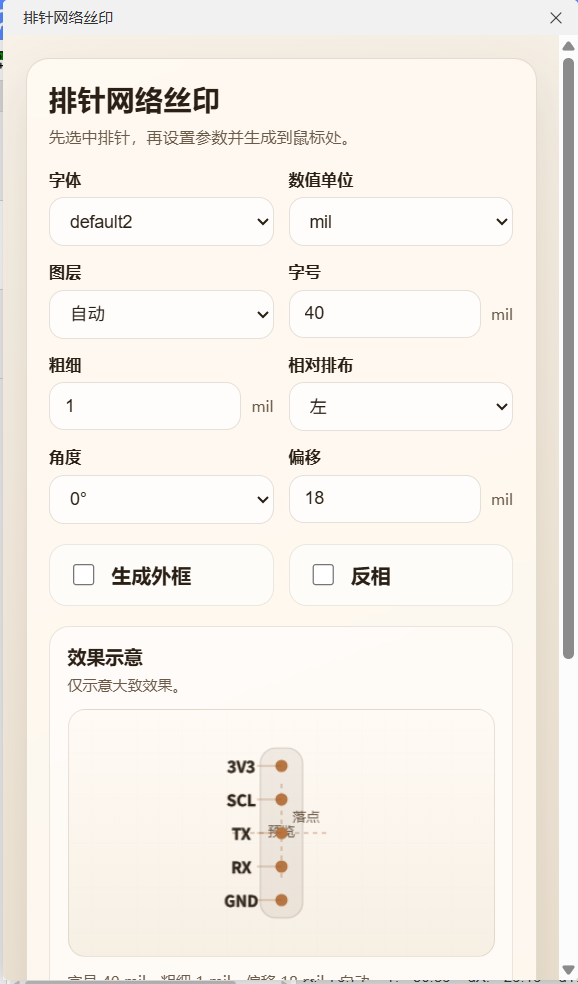
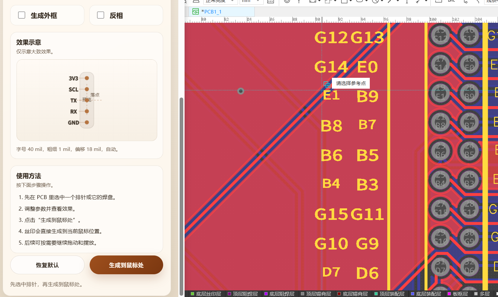

[简体中文](./README.md) | [English](./README.en.md) | [繁體中文](./README.zh-Hant.md) | [日本語](./README.ja.md) | [Русский](#)

# Silk For Headers

Расширение для PCB-редактора JLCEDA / EasyEDA Pro. Автоматически генерирует надписи шелкографии для гребенок и pin header на основе сетей, подключенных к их площадкам.

## Возможности

- Определяет выбранный header-компонент или находит родительский header по выбранной площадке.
- Извлекает короткие подписи из имен сетей и использует резервные значения вида `P1`, `P2`, если сеть отсутствует.
- Автоматически анализирует ориентацию компонента, строки контактов и одно- или двухрядную структуру.
- Предоставляет панель настроек для выбора шрифта, единиц, слоя, размера текста, толщины линии, стороны размещения, угла, смещения, рамки и инверсии.
- Показывает предварительный просмотр и размещает всю группу шелкографии как один объединенный объект в текущей позиции курсора.

## Как использовать

1. В PCB-редакторе выберите один header-компонент или любую его площадку.
2. Откройте верхнее меню `排针丝印 > 生成排针丝印...`.
3. Настройте параметры на панели и проверьте превью.
4. Переместите курсор в нужную точку на холсте PCB.
5. Нажмите `生成到鼠標處`, чтобы создать группу шелкографии в текущем положении курсора.





## Параметры

- Шрифт: выбор шрифта для рендеринга текста.
- Единицы: переключение между `mil` и `mm`.
- Слой: автоматически по стороне компонента либо принудительно верхний / нижний слой шелкографии.
- Размер и толщина: управляют габаритами текста и толщиной штрихов.
- Относительное расположение и угол: задают сторону относительно header и режим поворота.
- Смещение: определяет расстояние между подписью и корпусом header.
- Рамка: добавляет контур вокруг всей группы надписей.
- Инверсия: рисует текст в инвертированном стиле.

## Ограничения

- Работает только в PCB-редакторе.
- За один запуск обрабатывается только один header.
- Требуется доступ к данным площадок и сетей выбранного компонента.
- Координата размещения берется из текущего положения курсора на холсте PCB, поэтому перед генерацией курсор нужно переместить в целевую точку.

## Разработка

Требования:

- Node.js `>= 20.17.0`
- Среда выполнения расширений JLCEDA / EasyEDA Pro `^3.0.0`

Локальная сборка:

```bash
npm install
npm run build
```

После сборки пакет `.eext` появится в каталоге `build/dist/`. Его можно импортировать в JLCEDA / EasyEDA Pro для установки и тестирования.

## Структура проекта

- `src/index.ts`: точка входа расширения, регистрация меню и открытие панели.
- `iframe/header-silk.html`: разметка панели настроек.
- `iframe/js/header-silk.js`: анализ header, превью, обработка параметров и генерация шелкографии.
- `iframe/css/header-silk.css`: стили панели.
- `build/packaged.ts`: упаковка проекта в файл `.eext`.
- `locales/`: ресурсы локализации для метаданных и подсказок.

## Справка

- Руководство по JLCEDA Pro API: https://prodocs.lceda.cn/cn/api/guide/

## Лицензия

Проект распространяется по лицензии Apache-2.0. Подробности см. в [LICENSE](./LICENSE).
